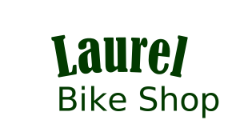

# Laurel Bike Shop

Welcome to my Phase 4 Project for the Flatiron School Software Engineer Program.

Check out a demo of this project!(Click the image for a video walkthrough)

##Local Setup

If you would like to clone this project and check it out locally:

You will first need to install the proper packages with:

- bundle install
- npm install --prefix client

then

- `rails s`: run the backend on [http://localhost:3000](http://localhost:3000)
- `npm start --prefix client`: run the frontend on
  [http://localhost:4000](http://localhost:4000)
